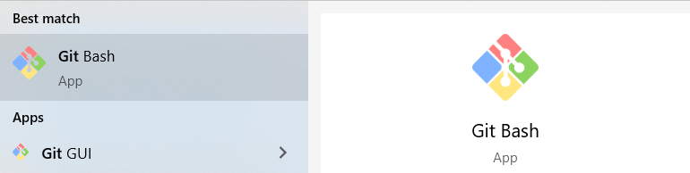
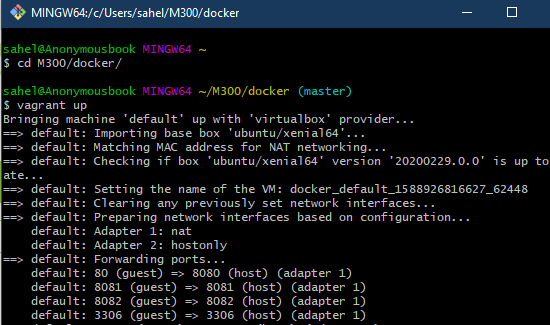
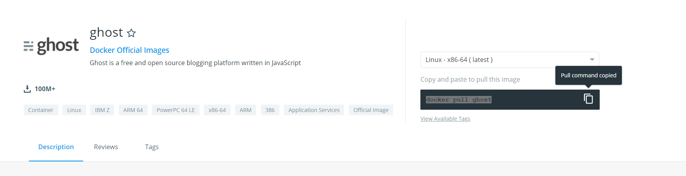
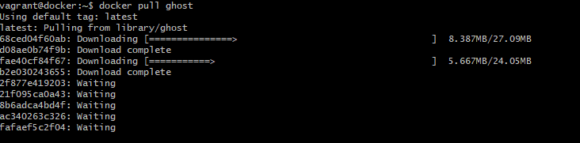
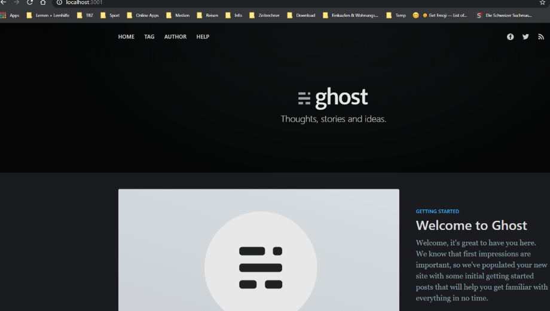

# LB3 Dokumentation
## Container


| Autor | Lahoo |
| ------ | ------ |
| Klasse | ST17c|
| Projekt | Ghost |
| Lehrperson | Marco Berger|
| Firma | entex GmbH|
| Version | 1.0 |


## Inhaltsverzeichnis:

  > Aufgabenstellung
  
  > Projektübersicht
  
  > Vorgang
  
  > Ghost installieren
  
  > Portweiterleitung
  
  > Quellenverzeichnis
  
  > Links


## Aufgabe
### Wir erstellen ein selbst gewähltes Projekt, welches auf der Docker Container-Technologie basiert. Dabei erstellen wir einen Service, der innerhalb eines oder mehrerer Container implementiert wird.

  -  Prinzipiell muss der Service von ausserhalb des PC / VM genutzt werden können, Bsp. mit einem Fat-Client (SQL-Client, Teamspeak usw.) oder einem Webbrowser. Ausnahmen müssen begründet sein.
  - Der Service soll entweder aus einem selber erstellten Docker-Image oder aus einer Kombination von Docker-Files bestehen. In jedem Fall muss beschrieben sein, wie der Docker Service betrieben werden kann.
  - Sämtlicher verwendeter Code (auch Fremdcode) muss ausreichend dokumentiert sein.
  -  Es muss dokumentiert sein, wie der Service funktioniert und benutzt werden kann.
  - Sie müssen mündlich über ihren Service Auskunft geben können.
  - Alle relevanten Files müssen auf GIT-Hub / GIT-Lab abgelegt und für die LP freigegeben sein
 *** 
## Projektübersicht
Mein Ziel ist einen Images meiner Wahl vom dockerhub auf meinem lokalen VM herunterzuladen. Ich werden den Container starten und derren Funktion nutzen. Dabei handelt es sich um die relativ einfache Blog Applikation Ghost.

*** 
## Vorgang 
### Umgebung
Ich installiere eine Linux VM via Vagrant-File aus dem Ordner Docker, den uns Herr Berger zur Verfügung gestellt hat. In der VM ist Docker schon installiert. Die VM wird wie folgt installiert:

1. Git Bash öffenen und zum gewünschten Verzeichniss navigieren
2. Danach führt man den Vagrant File mit dem Befehl ***vagrant up*** aus.
3. Sobald die Installation fertig gestellt wurde, kann man sich mit ***vagrant ssh*** in die VM einloggen.
 
 
## Ghost Installieren
1. Ghost in Docker library auswählen
2. Folgendes Befehl ausführen ***docker pull ghost***



## Portweiterleitung

> Zugriff vom localen PC
- Wenn wir in der Lage sein möchten, vom Host ohne die IP des Containers auf die Instanz zuzugreifen, können wir die Standard-Port-Mappings verwenden:
```
docker run -d --name some-ghost -e url=http://localhost:3001 -p 3001:2368 ghost

```
 *** 
## Reflexion
Des war ein spezielles Modul. Wir haben uns mit den Grundlagen von Docker und container beschäftigt. 
Amn Anfang hat es viele Fragezeichen gegeben, die sich tagtäglich gelöst haben. Als wir wegen Corona zu Distanz-Learning gewechselt haben, hatte ich lagsam Probleme. Ich brauchte für die Aufgaben im Vergleich viel mehr Zeit und konnte ab und zu die Aufgabenstellung nicht verstehen. Dies führte meist dazu, dass ich etwas hinter der Zeitplan war.
Heute konnnte ich nochmals mit dem Projekt GAS geben. Ich konnte ghost erfolgreich installieren und testen. Der Modul war interessant und der Inhalt auch, jedoch habe ich das Gefühl, dass wir insgesammt zu wenig Zeit hatten, um den gesammten Inhalt des Moduls zu verstehen. Ich danke Herr Berger für die Unterstützung und Geduld in diesem Modul.

***
## Quellenangaben
### Links

[Link Bild][1]

[1]: https://devopedia.org/images/article/101/8323.1565281088.png"

